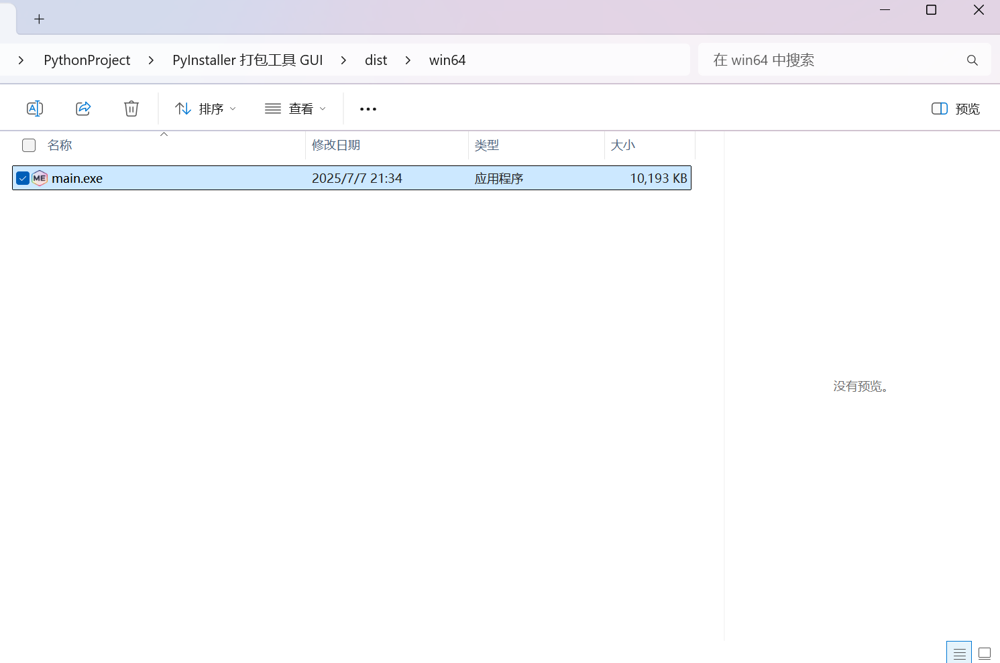

<h1>PYIGUI：pyinstaller-GUI</h1>

ENGLISH | <a href="README_zh.md">简体中文</a>

---

## ✨ Features

- 🚀 **Simple GUI for PyInstaller**
- 📦 **One-click executable packaging**
- 🖥️ **User-friendly interface**
- 🛠️ **Basic configuration options**
- 📊 **Supports Win32 and Win64**

  

  

  

---

## 🛠️ Installation

### 1. Prerequisites

- Python 3.6+
- PyInstaller (will be installed automatically)

### 2. Installation Methods

Download the zip file or the <a href="https://github.com/AMTOPA/pyinstaller-GUI/releases">release</a>.

